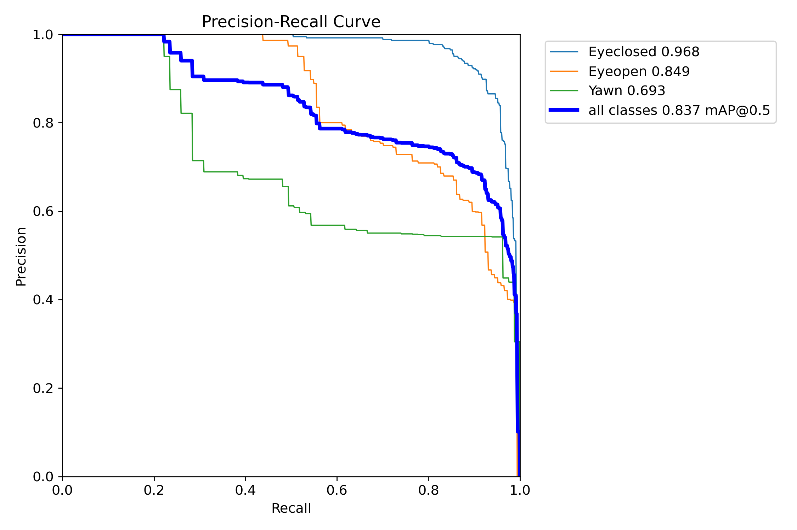
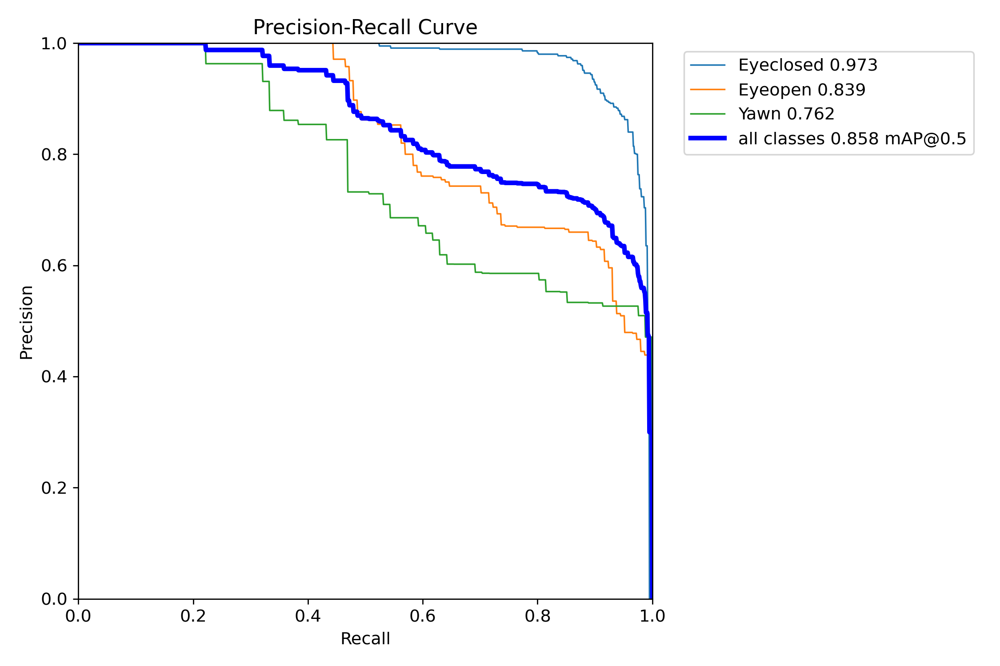
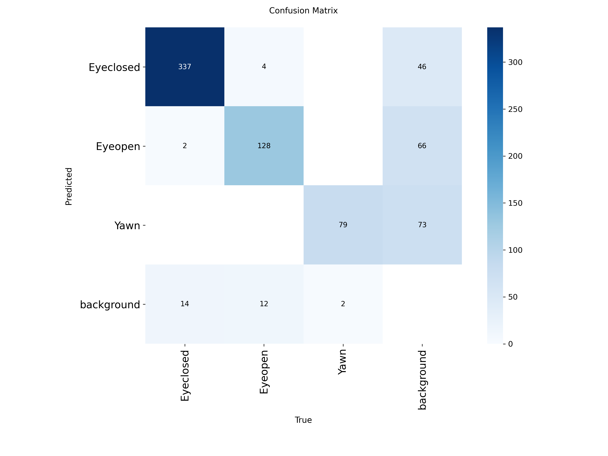
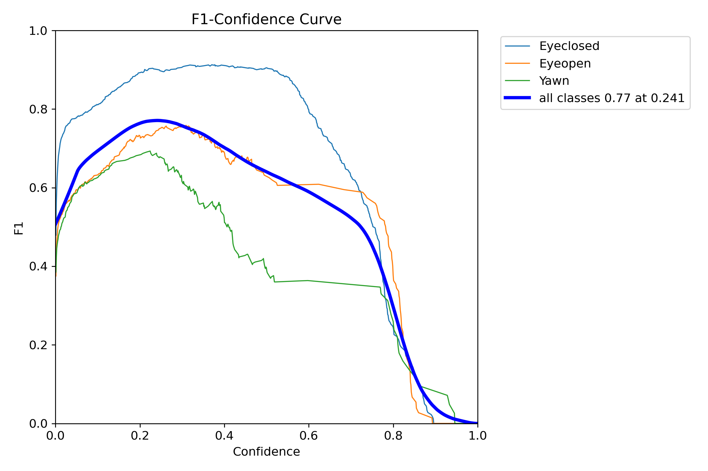
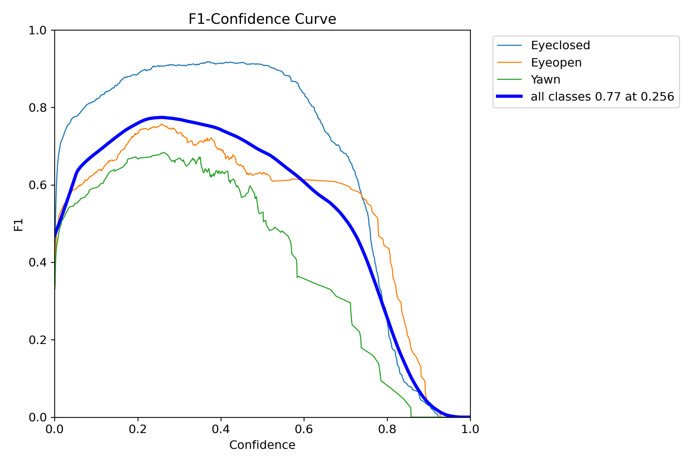
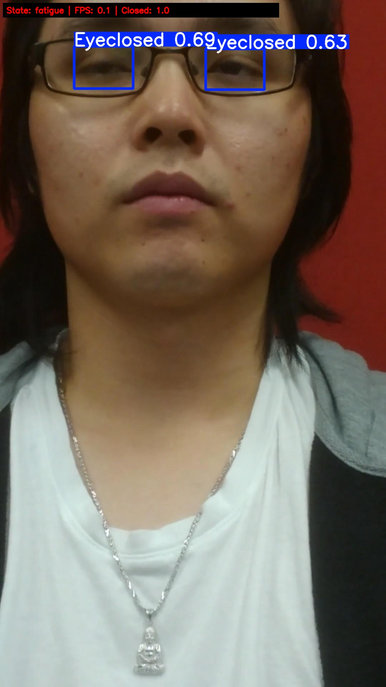
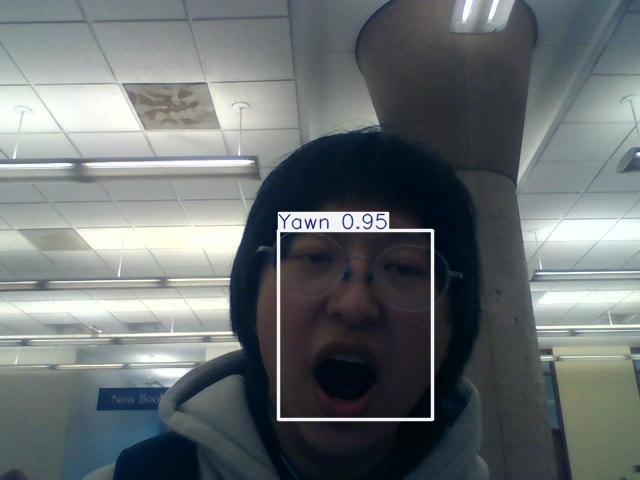
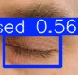

# 基于 YOLOv8 与注意力机制的疲劳驾驶面部识别系统

> 说明：本文档为毕业论文正文初稿，可继续按学校论文模板调整封面、目录、页眉页脚、图表编号、参考文献格式和致谢等内容。

## 摘要

疲劳驾驶是道路交通安全中的重要风险因素之一。驾驶员在长时间驾驶、睡眠不足或注意力下降时，容易出现闭眼、频繁眨眼、打哈欠等疲劳表征，进而影响车辆操控能力和突发情况反应速度。针对传统疲劳检测方法存在接触式设备佩戴不便、主观判断滞后以及复杂环境下检测稳定性不足等问题，本文设计并实现了一种基于 YOLOv8 与注意力机制的疲劳驾驶面部识别系统。

系统以驾驶员面部图像为输入，使用 YOLOv8n 作为基线目标检测模型，对闭眼、睁眼和打哈欠三类疲劳相关面部特征进行检测。为进一步提升模型对眼部、嘴部等局部区域的特征表达能力，本文在 YOLOv8n 主干网络中引入 CBAM 注意力模块，构建 YOLOv8n + CBAM 改进模型。系统采用 Python、PyTorch、OpenCV 和 PyQt5 完成模型训练、推理检测与桌面端可视化演示，并在 Slurm GPU 服务器上完成模型训练，在本地 Windows 环境下完成系统演示验证。

实验结果表明，YOLOv8n 基线模型在验证集上的 mAP50 为 0.8347，mAP50-95 为 0.5368；引入 CBAM 注意力机制后，模型 mAP50 提升至 0.8580，mAP50-95 提升至 0.5470，Recall 从 0.9114 提升至 0.9370。其中，打哈欠类别的 mAP50 从约 0.693 提升至 0.762，说明注意力机制对嘴部局部疲劳特征具有一定增强作用。系统测试结果表明，本文实现的桌面演示系统能够完成图片、视频和摄像头输入的检测流程，并支持疲劳状态显示、检测截图保存和日志记录，基本满足毕业设计系统演示和实验分析要求。

**关键词**：疲劳驾驶；面部识别；YOLOv8；注意力机制；CBAM；PyQt5

## Abstract

Fatigued driving is one of the major risk factors in road traffic safety. When drivers experience long-term driving, insufficient sleep, or decreased attention, facial behaviors such as eye closure and yawning may appear and further affect driving safety. To address the inconvenience of contact-based fatigue detection and the instability of traditional methods in complex scenes, this thesis designs and implements a facial fatigue recognition system based on YOLOv8 and attention mechanism.

The proposed system takes driver facial images as input and uses YOLOv8n as the baseline object detection model to recognize three fatigue-related facial states: closed eyes, open eyes, and yawning. To improve the representation ability of local facial features around the eyes and mouth, a CBAM attention module is introduced into the YOLOv8n backbone, forming an improved YOLOv8n + CBAM model. The system is implemented using Python, PyTorch, OpenCV, and PyQt5. Model training is performed on a Slurm GPU server, while local demonstration and testing are completed on a Windows environment.

Experimental results show that the YOLOv8n baseline achieves 0.8347 mAP50 and 0.5368 mAP50-95 on the validation set. After introducing the CBAM attention mechanism, the improved model achieves 0.8580 mAP50 and 0.5470 mAP50-95, while Recall increases from 0.9114 to 0.9370. The mAP50 of the yawning class improves from approximately 0.693 to 0.762, indicating that the attention mechanism enhances local mouth feature representation. System testing shows that the desktop demonstration program can complete image, video, and camera-based detection, and supports fatigue state display, screenshot saving, and log recording.

**Key words**: fatigued driving; facial recognition; YOLOv8; attention mechanism; CBAM; PyQt5

## 第 1 章 绪论

### 1.1 研究背景

随着机动车保有量持续增长，道路交通安全问题受到越来越多关注。疲劳驾驶是导致交通事故的重要因素之一，尤其在长途运输、夜间行驶和连续驾驶等场景中，驾驶员容易因注意力下降、反应迟缓和判断能力降低而产生安全隐患。与超速、酒驾等行为相比，疲劳驾驶具有更强的隐蔽性。驾驶员在疲劳初期往往难以及时察觉自身状态变化，而一旦出现短时闭眼或意识模糊，事故风险会显著增加。

疲劳驾驶检测方法主要包括生理信号检测、车辆行为检测和视觉特征检测等。生理信号检测通常通过脑电、心电或肌电等传感器获取驾驶员身体状态，检测结果较为直接，但设备成本高、佩戴不便，容易影响驾驶体验。车辆行为检测主要分析方向盘转角、车道偏移和制动行为等信息，部署相对简单，但容易受到道路环境、驾驶习惯和车辆状态影响。基于视觉的疲劳检测方法通过摄像头采集驾驶员面部图像，识别闭眼、眨眼、打哈欠、低头等外观特征，具有非接触、成本较低和直观可解释等优点，因此成为疲劳驾驶检测研究中的重要方向。

近年来，深度学习目标检测模型在图像识别任务中取得了良好效果。YOLO 系列模型以端到端检测、推理速度快和工程部署方便等特点，被广泛应用于交通监控、工业检测和人脸相关任务。YOLOv8 作为较新的目标检测框架，具有较好的检测精度和实时性能。对于疲劳驾驶场景，闭眼和打哈欠均属于局部面部特征，目标区域相对较小，且容易受到姿态、光照和遮挡影响。因此，仅依赖普通卷积特征提取可能难以充分关注关键区域。注意力机制能够通过通道或空间加权增强重要特征表达，为提升疲劳特征识别效果提供了可行思路。

基于上述背景，本文设计并实现一种基于 YOLOv8 与注意力机制的疲劳驾驶面部识别系统。系统以闭眼、睁眼和打哈欠为检测目标，完成模型训练、推理检测、疲劳状态判断和桌面演示闭环，并通过基线模型与注意力机制改进模型的实验对比，验证注意力机制在疲劳面部特征识别任务中的作用。

### 1.2 研究意义

本文研究具有一定的理论意义和工程应用价值。

从理论角度看，疲劳驾驶面部识别任务涉及目标检测、局部特征表达和时序状态判断等多个问题。本文在 YOLOv8n 基线模型基础上引入 CBAM 注意力机制，通过对比实验分析注意力模块对闭眼、睁眼和打哈欠类别检测效果的影响，为轻量化目标检测模型在驾驶员疲劳检测场景中的应用提供参考。

从工程角度看，本文不仅完成模型训练和实验分析，还实现了一个 PyQt5 桌面演示系统。系统支持图片、视频和摄像头输入，能够显示检测框、类别置信度、疲劳状态和报警提示，并支持截图保存和日志记录。该系统能够为毕业设计答辩、实验复现和后续功能扩展提供可运行基础。

### 1.3 国内外研究现状

疲劳驾驶检测研究大致可分为三类：基于生理信号的方法、基于车辆行为的方法和基于视觉特征的方法。基于生理信号的方法通常通过脑电、心电、眼电等信号判断驾驶员状态，具有较高的理论可靠性，但硬件设备较复杂，使用时需要与人体接触，不适合普通驾驶场景长期部署。基于车辆行为的方法通过分析方向盘操作、车道偏移、车辆速度变化等信息进行疲劳判断，采集方便，但容易受到道路条件、车辆性能和驾驶员个人习惯影响。

基于视觉特征的方法主要关注驾驶员面部和头部状态。例如，PERCLOS 指标通过统计一定时间窗口内眼睛闭合比例判断疲劳程度；打哈欠检测通过嘴部张开状态反映疲劳趋势；头部姿态检测则用于发现低头、点头等异常行为。传统视觉方法往往依赖人工设计特征，在复杂光照、姿态变化和遮挡场景下鲁棒性有限。随着深度学习发展，卷积神经网络和目标检测模型逐渐成为视觉疲劳检测的重要工具。

YOLO 系列模型因检测速度快、部署方便，适合实时疲劳检测场景。与两阶段目标检测方法相比，YOLO 将目标定位和分类统一在单一网络中完成，能够较好满足实时性要求。与此同时，注意力机制在计算机视觉任务中被用于增强重要通道和空间区域的特征响应。CBAM 作为一种轻量注意力模块，包含通道注意力和空间注意力两个部分，可嵌入卷积网络中提升特征表达能力。本文结合 YOLOv8n 与 CBAM，重点验证其在闭眼、睁眼和打哈欠检测任务中的实际效果。

从近年研究趋势看，疲劳驾驶检测正在由单一特征判断逐步转向多特征融合和深度模型端到端识别。Albadawi 等对近年来驾驶员嗜睡检测系统进行了综述，指出视觉、行为和生理信号方法各有适用场景，其中视觉方法在非接触部署方面具有较强优势[1]。Saleem 等从生理信号角度系统总结了疲劳检测方法，说明脑电、心电等信号能够提供较直接的生理依据，但在普通驾驶场景中仍存在佩戴不便和设备成本问题[2]。Abd El-Nabi 等进一步归纳了机器学习和深度学习在驾驶疲劳检测中的应用，认为深度网络能够降低人工特征设计依赖，并在复杂图像条件下获得更强表达能力[3]。这些研究为本文选择基于视觉的深度学习检测路线提供了依据。

在具体算法方面，近年来不少研究开始采用 CNN、LSTM、Transformer 或 YOLO 系列模型识别疲劳状态。Majeed 等提出基于深度卷积神经网络的驾驶员嗜睡检测方法，验证了深度特征在眼部状态识别中的有效性[6]。Safarov 等将深度学习与计算机视觉、眼动眨眼分析结合，用于实时驾驶员嗜睡检测，说明视觉检测模型具备较强的实时应用潜力[9]。Albadawi 等从眼睛纵横比、嘴部纵横比和头部姿态等视觉特征构建实时驾驶员嗜睡检测系统，体现了多视觉线索融合在疲劳驾驶识别中的应用价值[10]。部分研究将视频连续帧作为输入，利用时序模型捕捉闭眼持续时间和打哈欠频率等动态信息；也有研究使用目标检测模型直接定位眼睛、嘴部或面部关键区域，再结合规则或分类器输出疲劳状态。与直接分类整张人脸图像相比，目标检测方法能够给出边界框和类别置信度，结果更具可解释性，便于在系统界面中展示。

综合国内外研究现状可以看出，疲劳驾驶检测仍面临三类问题：一是实际驾驶环境复杂，夜间弱光、强光反射、眼镜遮挡、侧脸姿态等因素会降低检测稳定性；二是疲劳状态具有时序性，单帧闭眼或张嘴不一定等价于疲劳，需要结合连续帧趋势进行判断；三是系统部署要求实时性，模型不能只追求精度而忽视推理速度和资源占用。本文围绕这些问题，选择轻量 YOLOv8n 作为基线模型，在模型中加入 CBAM 注意力机制增强局部疲劳特征表达，并在系统层面保留 LSTM + Attention 时序建模接口，为后续连续视频疲劳分类提供扩展空间。

### 1.4 本文主要研究内容

本文主要完成以下工作：

1. 构建疲劳驾驶面部识别数据集训练流程。使用 Roboflow 导出的 YOLOv8 格式数据集，完成训练集、验证集和测试集配置，检测类别包括 Eyeclosed、Eyeopen 和 Yawn。
2. 实现 YOLOv8n 基线检测模型。基于 Ultralytics YOLOv8 框架完成模型训练、验证、推理和权重导出。
3. 设计 YOLOv8n + CBAM 注意力机制改进模型。在 YOLOv8n 主干网络高层语义特征位置引入 CBAM 模块，增强模型对眼部和嘴部区域的关注能力。
4. 实现疲劳状态判断与桌面演示系统。使用 OpenCV 完成图像处理，使用 PyQt5 完成桌面界面，支持图片、视频和摄像头输入。
5. 完成实验对比与系统测试。比较 YOLOv8n 与 YOLOv8n + CBAM 的 Precision、Recall、mAP50、mAP50-95 和推理速度，并记录系统功能测试结果。

围绕上述研究内容，本文在实现过程中重点关注三个问题。第一是检测目标的可解释性。与直接输出疲劳或非疲劳的二分类方法相比，本文将闭眼、睁眼和打哈欠作为中间可观察目标，使系统结果能够被直观理解，也便于后续结合 PERCLOS、打哈欠频率等规则进行状态判断。第二是模型轻量化与部署可行性。YOLOv8n 的参数量较小，能够在保证一定精度的同时降低推理开销，适合毕业设计系统演示和普通终端环境运行。第三是实验闭环完整性。本文不仅记录模型精度指标，还保留训练日志、混淆矩阵、PR 曲线、F1 曲线和系统截图，使论文中的实验结论具有可追溯依据。

本文的创新点主要体现在以下方面：一是在疲劳驾驶面部识别任务中构建了 YOLOv8n 基线模型与 YOLOv8n + CBAM 注意力模型的对比实验流程；二是在工程实现中完成 Slurm GPU 训练、本地 CPU 推理和 PyQt5 桌面演示的跨环境闭环；三是将模型检测结果进一步转换为疲劳状态提示，并通过日志和截图功能保存系统运行证据。虽然本文尚未完成大规模真实车辆环境部署，但已形成从算法训练到系统展示的完整原型，为后续引入视频序列时序建模和车载端部署奠定基础。

### 1.5 论文组织结构

本文共分为七章。第 1 章介绍研究背景、研究意义、国内外研究现状以及本文主要研究内容。第 2 章介绍本文使用的相关技术理论基础，重点说明 YOLOv8 目标检测算法、CBAM 注意力机制以及系统实现所涉及的关键支撑技术。第 3 章介绍数据集构建与预处理过程，重点说明数据来源、类别设置、数据划分、配置方式以及数据增强策略。第 4 章介绍模型与算法设计及改进方案，重点说明 YOLOv8n 基线模型、CBAM 嵌入方案、疲劳状态判定方法以及训练策略。第 5 章介绍实验设计与结果分析，通过对比实验、曲线图和效果图验证注意力机制改进方案的有效性。第 6 章介绍系统设计与实现，说明系统需求、总体架构、关键模块实现以及桌面演示界面。第 7 章总结全文工作，并提出后续改进方向。

## 第 2 章 相关技术理论基础

### 2.1 YOLOv8 目标检测算法

YOLO 是一种典型的一阶段目标检测算法，其核心思想是将目标检测任务转化为端到端的回归与分类问题。与两阶段检测算法相比，一阶段检测算法省去了候选区域生成过程，因此在推理速度上具有明显优势。YOLOv8 延续了 YOLO 系列实时检测的特点，同时在模型结构、训练策略和工程接口方面进行了优化，适合快速搭建检测训练和推理系统。

本文选择 YOLOv8n 作为基线模型。YOLOv8n 是 YOLOv8 系列中的轻量模型，参数量较小，推理速度较快，适合毕业设计系统演示和普通 PC 环境部署。对于疲劳驾驶面部识别任务，系统需要实时识别闭眼、睁眼和打哈欠等小目标局部特征，YOLOv8n 在精度和速度之间具有较好的平衡。

YOLOv8 的训练流程通常包括数据读取、图像增强、前向传播、损失计算、反向传播和验证评估等步骤。对于本文任务而言，训练数据采用 YOLO 标注格式，每个标签文件包含目标类别编号和归一化边界框坐标。模型训练完成后，系统可通过验证集计算 Precision、Recall、mAP50 和 mAP50-95 等指标。Precision 反映检测结果中正确目标所占比例，Recall 反映真实目标被检测出的比例，mAP 则综合衡量不同类别和不同置信度阈值下的检测性能。由于疲劳检测更关注风险状态不被漏检，因此本文在分析实验结果时同时关注 mAP 和 Recall 指标。

### 2.2 CBAM 注意力机制

CBAM 是一种轻量级卷积注意力模块，主要由通道注意力和空间注意力组成。通道注意力用于判断不同特征通道的重要程度，空间注意力用于判断图像不同空间位置的重要程度。通过这两个步骤，CBAM 能够对输入特征进行再加权，使网络更加关注对任务有贡献的特征区域。

在疲劳驾驶面部识别任务中，闭眼与打哈欠通常发生在眼部和嘴部等局部区域。这些区域在整张图像中占比不大，且容易受到头部姿态、光照和遮挡影响。因此，在检测模型中引入注意力机制，有助于模型在特征提取阶段增强关键区域表达。本文将 CBAM 模块加入 YOLOv8n 主干网络 SPPF 模块之后，使高层语义特征在进入检测头前得到进一步强化。

CBAM 模块的优势在于结构简单、额外参数量较小，适合嵌入轻量目标检测网络。通道注意力能够根据全局平均池化和最大池化结果学习不同通道权重，空间注意力则进一步根据通道维度压缩后的特征图学习关键空间位置。对于闭眼目标，模型需要关注眼裂区域的细微变化；对于打哈欠目标，模型需要关注嘴部张开幅度和边界区域。注意力机制能够使网络在复杂背景下更集中地利用这些局部信息，从而改善小目标或局部目标的检测表现。

### 2.3 PyTorch 与 Ultralytics 框架

PyTorch 是常用的深度学习框架，具有动态图机制、易调试和生态完善等特点。Ultralytics YOLOv8 基于 PyTorch 实现，提供了统一的训练、验证、推理和模型导出接口。本文通过 Ultralytics 框架完成 YOLOv8n 和 YOLOv8n + CBAM 的训练与验证，并使用自定义训练入口对数据配置、训练轮数、输入尺寸、batch size 和设备编号等参数进行封装。

在工程实现中，PyTorch 主要承担模型加载、训练和推理计算任务。Ultralytics 框架进一步封装了数据增强、损失函数、指标评估、训练日志保存和权重导出等流程，使本文能够把重点放在数据配置、模型结构对比和系统集成上。对于毕业设计项目而言，使用成熟框架能够减少重复实现底层训练流程带来的错误风险，也便于在服务器和本地环境之间保持一致的实验入口。

本文在使用框架时并未完全依赖命令行接口，而是封装了 `src/train/train_yolo.py` 训练入口。这样做的原因是论文实验需要多次复现实验参数，如果每次手动输入较长命令，容易出现数据路径、训练轮数或模型配置不一致的问题。通过脚本封装后，Slurm 训练脚本、本地调试命令和论文实验记录可以使用同一套参数命名方式，提高了实验可追溯性。

### 2.4 OpenCV 图像处理技术

OpenCV 是常用的计算机视觉库，提供图像读取、视频处理、摄像头采集、图像绘制和格式转换等功能。本文在推理检测和桌面演示系统中使用 OpenCV 完成图片、视频和摄像头帧读取，并将模型输出的检测框、类别名称、置信度和 FPS 绘制到图像上。OpenCV 的使用使系统能够处理多种输入来源，并为桌面界面提供实时显示画面。

### 2.5 PyQt5 桌面界面技术

PyQt5 是 Python 常用的桌面图形界面开发框架。本文使用 PyQt5 实现疲劳驾驶面部识别系统的演示界面，主要包括模型加载、图片或视频选择、摄像头打开、开始检测、停止检测、状态显示、报警提示、截图保存和日志显示等功能。为了避免模型推理阻塞界面响应，系统使用独立检测线程处理视频帧，并通过信号机制将检测结果返回主界面。

### 2.6 ONNX Runtime 模型部署

ONNX 是一种开放的模型交换格式，能够在不同深度学习框架和部署环境之间传递模型。ONNX Runtime 可以用于模型推理加速和跨平台部署。本文在训练完成后导出 YOLOv8n 和 YOLOv8n + CBAM 的 ONNX 权重，为后续部署实验和性能优化预留接口。

在实际应用中，训练框架和部署框架往往并不完全相同。训练阶段通常依赖 PyTorch 的灵活性，而部署阶段更关注推理速度、运行环境体积和跨平台兼容性。ONNX 格式可以把训练后的模型转换为通用中间表示，使模型后续能够在 ONNX Runtime、TensorRT 或其他推理引擎中运行。本文虽然主要完成 PyTorch 权重下的本地演示，但同步导出 ONNX 权重，能够为后续在 CPU、GPU 或边缘设备上进行推理性能对比提供基础。

## 第 3 章 数据集构建与预处理

### 3.1 数据来源与类别说明

本文使用 Roboflow 平台整理的 Driver_Drowsiness_YOLO 数据集。该数据集面向疲劳驾驶视觉检测任务构建，图像内容主要围绕驾驶员面部区域展开，能够覆盖闭眼、睁眼和打哈欠等与疲劳状态密切相关的外在表征。与直接进行疲劳二分类相比，本文把闭眼、睁眼和打哈欠视为可解释的中间检测目标，这样既便于模型训练，也便于后续通过规则方法进行疲劳状态判定。

检测类别包括闭眼、睁眼和打哈欠三类，类别编号与含义如表所示。

| 类别编号 | 类别名称 | 中文含义 |
| ---: | --- | --- |
| 0 | Eyeclosed | 闭眼 |
| 1 | Eyeopen | 睁眼 |
| 2 | Yawn | 打哈欠 |

### 3.2 数据集划分与配置

该数据集共包含 5413 张图像，并已经按照 YOLOv8 所需格式划分为训练集、验证集和测试集。具体划分结果如下表所示。

| 数据划分 | 图片数量 | 标签数量 |
| --- | ---: | ---: |
| 训练集 | 3790 | 3790 |
| 验证集 | 542 | 542 |
| 测试集 | 1081 | 1081 |
| 合计 | 5413 | 5413 |

数据集配置文件为 `configs/yolo_data.yaml`。该文件统一描述训练集、验证集和测试集路径以及类别名称，能够保证基线模型与改进模型在相同数据条件下完成训练与评估，从而为后续对比实验提供一致的数据基础。

### 3.3 数据增强与预处理策略

在训练阶段，本文采用 Mosaic、MixUp 和 HSV 色彩扰动等增强策略，以提升模型对不同光照、姿态变化和局部遮挡场景的适应能力。其中，Mosaic 可以通过多图拼接增强小目标检测的鲁棒性，MixUp 有助于改善模型泛化能力，HSV 色彩扰动则可增强模型对亮度和色彩变化的适应性。

在输入网络之前，数据会按照 YOLOv8 的标准流程完成尺寸缩放、边界填充和张量化处理。训练集使用随机增强方式提高样本多样性，验证集和测试集则保持稳定的预处理流程，以保证评价结果能够真实反映模型性能。

## 第 4 章 模型/算法设计与改进

### 4.1 疲劳面部特征的检测特点分析

疲劳驾驶面部识别的检测对象为闭眼、睁眼和打哈欠三类局部面部特征。与通用目标检测任务相比，这些目标具有三方面显著特点。

第一，目标区域占比小。眼部区域在整张面部图像中所占比例较低，嘴部虽然略大但仍属于局部区域。当摄像头距离较远或图像分辨率有限时，目标特征容易变得模糊，增加检测难度。第二，类内差异较大且类间容易混淆。闭眼、睁眼和打哈欠受到个体差异、面部姿态以及瞬时动作影响较大，其中 Eyeclosed 与 Eyeopen 还容易在低分辨率图像中产生混淆。第三，实际驾驶环境干扰较多。夜间弱光、强光反射、眼镜遮挡、侧脸姿态和视频压缩等因素都会降低模型稳定性。

### 4.2 YOLOv8n 基线模型结构分析

本文选择 YOLOv8n 作为基线模型。YOLOv8n 是 Ultralytics YOLOv8 系列中的轻量化模型，具有参数量小、推理速度快和部署成本较低等特点，适合毕业设计中的实时演示任务。

YOLOv8n 主要由骨干网络、颈部网络和检测头三部分构成。骨干网络负责提取图像的多层特征，颈部网络通过特征融合增强不同尺度信息，检测头则完成目标类别判定与边界框回归。对于本文的小目标局部疲劳特征识别任务而言，YOLOv8n 在精度与速度之间具有较好的平衡性，因此被选作对比实验的基准模型。

### 4.3 CBAM 注意力模块嵌入方案设计

为增强模型对眼部和嘴部关键区域的关注能力，本文在 YOLOv8n 基线模型的基础上引入 CBAM 注意力机制，构建 YOLOv8n + CBAM 改进模型。CBAM 模块同时具备通道注意力和空间注意力，能够在特征提取阶段对重要通道与关键区域进行再加权。

本文将 CBAM 模块插入 YOLOv8n 主干网络 SPPF 模块之后，对高层语义特征进行增强。对应的模型配置文件为 `configs/yolov8n_cbam.yaml`。这一嵌入位置既能够保持网络整体结构的轻量化，又能在进入检测头之前强化疲劳相关局部特征表达，便于观察注意力机制对检测结果的实际提升作用。

### 4.4 CBAM 注意力机制原理与计算流程

CBAM 由通道注意力模块和空间注意力模块串联组成。通道注意力首先对输入特征图进行全局平均池化与全局最大池化，再通过共享参数的多层感知机生成各通道权重，从而突出更重要的语义通道。空间注意力则进一步沿通道维度压缩特征图，并通过卷积操作学习关键空间区域的权重分布，使网络更加关注与目标相关的位置区域。

对于疲劳驾驶面部识别任务而言，闭眼和打哈欠通常只占据面部中的局部区域，且关键特征比较细微。CBAM 的引入能够促使模型在卷积特征中更加关注这些局部区域，从而提升对小目标和局部特征的表达能力。

### 4.5 改进模型参数与实时性分析

在模型改进方案选择上，本文没有直接采用参数量更大的 YOLOv8s 或 YOLOv8m，而是在 YOLOv8n 轻量骨干上引入 CBAM 模块。这种设计主要考虑到疲劳驾驶检测任务在实际应用中通常需要兼顾精度和实时性，若单纯增大模型规模，虽然有可能继续提高精度，但也会明显增加推理延迟和部署成本。

实验配置表明，引入 CBAM 后模型参数量仅由约 3.01M 增加到约 3.08M，推理耗时也仅有小幅上升，说明该改进方案能够在保持轻量化特征的前提下实现性能优化，适合本文的研究目标。

### 4.6 疲劳状态判定算法

YOLOv8 检测模型输出每帧中的 Eyeclosed、Eyeopen 和 Yawn 检测结果。系统在目标检测结果基础上提取闭眼置信度、睁眼置信度和打哈欠置信度等特征，并通过滑动窗口规则完成最终疲劳状态判定。

本文将状态划分为正常、疑似疲劳和疲劳三类。若窗口内闭眼比例达到较低阈值，或短时间内出现打哈欠行为，则判定为疑似疲劳；若闭眼比例继续升高，或者短时间内多次出现打哈欠，则判定为疲劳。该方法具有实现简单、可解释性强和便于系统演示等优点，能够较好满足毕业设计当前阶段对状态判断的要求。

### 4.7 训练策略设计

为保证基线模型与改进模型对比的公平性，本文在两组实验中采用相同训练策略。优化器使用 AdamW，学习率策略采用 Cosine LR，训练输入尺寸设置为 640，训练轮数设置为 50 轮。同时，训练过程中启用 Mosaic、MixUp 和 HSV 色彩扰动增强，以提高模型在复杂场景下的泛化能力。

对于改进模型，本文通过预训练权重迁移初始化与自定义 YAML 结构结合的方式完成训练设置。除模型结构差异外，其余训练参数保持一致，使得后续实验中模型性能变化主要能够归因于 CBAM 注意力机制的引入。

## 第 5 章 实验设计与结果分析

### 5.1 实验环境配置

服务器训练环境使用 Slurm 调度系统，GPU 节点为 plcyf-com-prod-gpu001，GPU 为 Tesla V100-PCIE-32GB，Python 版本为 3.11.11，PyTorch 版本为 2.5.1+cu121，YOLO 框架版本为 Ultralytics 8.4.45。本地演示环境为 Windows，PyTorch 使用 2.5.1+cpu，界面框架为 PyQt5。

### 5.2 评价指标与训练参数

本文主要采用 Precision、Recall、mAP50、mAP50-95 和推理耗时作为模型评价指标。其中，Precision 反映检测结果中真正例所占比例，Recall 反映真实目标被成功检出的比例，mAP50 和 mAP50-95 用于综合衡量检测框定位与分类性能。由于疲劳驾驶场景更关注风险目标的漏检问题，因此本文在分析实验结果时尤其关注 Recall 指标的变化。

正式训练使用 Slurm GPU 节点完成。两组模型均采用相同的数据集划分与训练参数，具体设置如下表所示。

| 参数 | 取值 |
| --- | --- |
| 基础模型 | YOLOv8n |
| 输入尺寸 | 640 |
| 训练轮数 | 50 |
| batch size | 16 |
| workers | 4 |
| 优化器 | AdamW |
| 学习率策略 | Cosine LR |
| 数据增强 | Mosaic、MixUp、HSV 色彩扰动 |

### 5.3 对比实验与训练结果

YOLOv8n 基线模型和 YOLOv8n + CBAM 改进模型均训练 50 轮。两组实验在相同数据集和相同输入尺寸下进行，整体指标如下表所示。

| 模型 | Precision | Recall | mAP50 | mAP50-95 | 参数量 | 推理耗时 |
| --- | ---: | ---: | ---: | ---: | ---: | ---: |
| YOLOv8n | 0.6868 | 0.9114 | 0.8347 | 0.5368 | 约 3.01M | 0.9 ms |
| YOLOv8n + CBAM | 0.6840 | 0.9370 | 0.8580 | 0.5470 | 约 3.08M | 1.1 ms |

实验结果表明，引入 CBAM 注意力机制后，模型 mAP50 由 0.8347 提升至 0.8580，mAP50-95 由 0.5368 提升至 0.5470，Recall 由 0.9114 提升至 0.9370。虽然模型参数量和推理耗时略有增加，但整体仍能满足实时检测需求。



图 5-1 展示了 YOLOv8n 基线模型在验证集上的 PR 曲线。PR 曲线能够反映不同置信度阈值下准确率与召回率之间的变化关系。当曲线整体更靠近右上角时，说明模型在保持较高召回率的同时仍能获得较高准确率。基线模型在闭眼类别上表现较好，但打哈欠类别仍存在一定提升空间。



图 5-2 展示了引入 CBAM 后的 PR 曲线。对比基线模型可以看出，注意力机制对整体检测性能有一定提升，尤其在打哈欠类别上改善更明显。这与疲劳驾驶场景中嘴部区域属于局部关键特征的特点相吻合。



图 5-3 为 CBAM 模型的混淆矩阵。混淆矩阵能够直观反映不同类别之间的误检与漏检情况。疲劳驾驶面部识别中，Eyeclosed 与 Eyeopen 均位于眼部区域，二者在部分低分辨率或光照不足图像中可能出现混淆；Yawn 类别则主要受嘴部张开程度、头部姿态和遮挡影响。通过混淆矩阵分析，可以为后续数据清洗和样本增强提供依据。

### 5.4 类别结果与改进效果分析

CBAM 模型最终验证指标如下。

| 类别 | Images | Instances | Precision | Recall | mAP50 | mAP50-95 |
| --- | ---: | ---: | ---: | ---: | ---: | ---: |
| Eyeclosed | 278 | 353 | 0.871 | 0.946 | 0.973 | 0.574 |
| Eyeopen | 107 | 144 | 0.657 | 0.889 | 0.839 | 0.531 |
| Yawn | 81 | 81 | 0.524 | 0.975 | 0.762 | 0.535 |

其中，闭眼类别识别效果最好，mAP50 达到 0.973；打哈欠类别 mAP50 达到 0.762，相比基线模型有明显提升，说明注意力机制对嘴部局部特征具有一定增强作用。Eyeopen 类别指标存在轻微波动，可能与样本数量、姿态差异和眼部区域较小有关，后续可通过数据清洗和样本增强继续优化。

从类别样本数量看，验证集中 Eyeclosed 为 353 个实例，Eyeopen 为 144 个实例，Yawn 为 81 个实例，类别分布并不完全均衡。样本数量较少的类别更容易受到个别困难样本影响，因此 Yawn 类别虽然 Recall 较高，但 Precision 相对较低，说明模型在积极检出打哈欠目标的同时仍存在一定误检。对于疲劳驾驶安全场景而言，较高召回率有助于减少疲劳风险漏检，但误检过多会影响报警体验。因此后续应在保持召回率的基础上，通过增加负样本、清洗异常标签和调整置信度阈值进一步提升 Precision。





图 5-4 和图 5-5 分别展示了基线模型与 CBAM 模型的 F1 曲线。F1 值综合考虑 Precision 和 Recall，适合用于观察模型在不同置信度阈值下的综合性能。结合 PR 曲线、F1 曲线和最终验证指标可以看出，CBAM 模型在整体性能上优于基线模型，但提升幅度并非无限扩大，说明注意力机制能够增强关键局部特征，但最终效果仍受到数据规模、标签质量和类别分布影响。

### 5.5 系统效果展示与分析

桌面系统已完成基本功能验证，能够在本地演示环境中展示模型检测结果和疲劳状态。主要验证结果如下表所示。

| 测试项 | 测试方法 | 预期结果 | 当前状态 |
| --- | --- | --- | --- |
| 模型加载 | 启动桌面系统并加载权重 | 模型正常加载，无 DLL 报错 | 通过 |
| 图片检测 | 选择测试集图片并点击开始检测 | 显示检测框、类别和置信度 | 通过 |
| 疲劳状态显示 | 输入打哈欠图片 | 显示疑似疲劳或疲劳状态 | 通过 |
| 日志记录 | 完成一次检测 | 在 `runs/app_logs/` 生成 CSV 日志 | 通过 |
| 截图保存 | 点击保存截图 | 在 `runs/screenshots/` 保存检测画面 | 通过 |
| 摄像头输入 | 点击打开摄像头 | 摄像头可用时实时显示检测结果 | 本机摄像头暂不可用 |

从验证结果看，系统已经完成本地演示闭环，能够在无摄像头、无视频样例的情况下，通过测试图片展示模型检测效果，基本满足毕业设计答辩展示需求。



图 5-6 为命令行单张图片推理结果。系统能够在图片中绘制检测框，并输出类别名称、置信度和疲劳状态。该结果证明模型权重在本地环境下能够正常加载并完成推理。



图 5-7 为 PyQt5 桌面系统检测打哈欠状态的界面截图。界面能够显示检测框、类别置信度、疲劳状态和日志路径，说明系统演示链路已经打通。



图 5-8 为另一张桌面系统检测截图。通过系统截图可以看出，本文系统不仅能够完成模型推理，还能够将结果以图形界面方式展示给用户，便于答辩演示和后续论文材料整理。

### 5.6 本章小结

本章通过对比实验验证了 YOLOv8n + CBAM 改进模型的有效性。实验结果表明，注意力机制的引入在保持模型轻量化特征的同时，提高了整体 mAP 和 Recall，尤其对打哈欠这一局部特征类别有较明显的增强作用。

从实验分析结果看，改进模型的性能提升主要来源于其对关键局部区域的关注能力增强，但模型效果仍会受到数据规模、类别分布和标签质量影响。系统效果展示进一步说明，当前模型与桌面演示程序已经能够形成较完整的实验闭环，为后续论文撰写和答辩展示提供了支撑。

## 第 6 章 系统设计与实现

### 6.1 系统需求分析

本文设计的疲劳驾驶面部识别系统主要面向毕业设计实验与演示场景，要求能够完成从模型训练到本地推理展示的完整流程。系统应支持使用 YOLOv8 格式数据集训练疲劳面部特征检测模型，并能够在图片、视频或摄像头输入下输出检测结果和疲劳状态。

系统总体目标包括四个方面：第一，完成闭眼、睁眼和打哈欠三类目标检测；第二，完成基线模型与注意力机制改进模型对比实验；第三，实现桌面端可视化演示程序；第四，保存实验结果、截图和日志，便于论文撰写和答辩展示。

从使用场景看，系统主要面向研究开发人员和答辩演示用户两类对象。前者更关注训练流程的可复现性、实验参数的可配置性以及结果管理的完整性，后者更关注界面是否直观、检测结果是否清楚以及系统操作是否简便。因此，系统在设计过程中需要同时兼顾算法实验和系统演示两类需求。

### 6.2 系统总体架构设计

本系统采用“目标检测模型 + 疲劳状态判定 + 桌面演示系统”的总体架构。系统首先通过图片、视频或摄像头输入获取驾驶员面部图像，然后使用 YOLOv8 系列目标检测模型识别闭眼、睁眼和打哈欠等疲劳相关面部特征，最后结合滑动窗口规则对驾驶员疲劳状态进行判断，并在桌面界面中实时显示检测结果、疲劳状态和报警信息。

系统处理流程为：

```text
图像/视频输入 -> 图像预处理 -> YOLOv8 检测 -> 疲劳特征提取 -> 疲劳状态判断 -> 界面显示与日志保存
```

系统主要包括数据管理模块、模型训练模块、推理检测模块和桌面演示模块。数据管理模块负责维护数据集配置、训练参数和实验结果；模型训练模块负责完成 YOLOv8n 基线模型与 YOLOv8n + CBAM 改进模型训练；推理检测模块负责处理图片、视频和摄像头输入；桌面演示模块负责显示检测画面、疲劳状态、报警提示，并支持截图与日志保存。

### 6.3 系统演示界面设计

桌面演示系统使用 PyQt5 实现，主要支持选择本地图片进行单张检测、选择本地视频进行连续检测、打开摄像头进行实时检测、显示检测框和类别置信度、显示疲劳状态和报警提示、保存当前检测截图以及自动生成 CSV 检测日志等功能。界面设计以演示清晰、操作简单和结果直观为目标，使用户能够快速完成模型效果展示。

界面布局按照“输入控制、检测画面、状态提示、日志反馈”的思路组织。顶部区域用于选择模型权重、图片、视频或摄像头输入，中间区域显示检测后的画面，右侧或下方显示当前状态、FPS、报警信息和日志路径。这样的布局能够让用户在一次演示中同时看到输入来源、模型检测结果和疲劳状态判断，减少在多个窗口之间切换的操作成本。

考虑到毕业设计答辩时演示环境可能不稳定，系统界面还对异常情况进行了提示处理。例如，当摄像头不可用、模型权重不存在或输入文件无法打开时，系统不会直接退出，而是弹出错误提示并保留主窗口可操作状态。图片输入默认只载入画面，用户点击“开始检测”后才执行模型推理，避免误以为选择文件后系统已经完成检测。

### 6.4 开发环境与项目结构

本文采用 Python 作为主要开发语言，深度学习框架使用 PyTorch，目标检测模型基于 Ultralytics YOLOv8 实现，图像处理使用 OpenCV，桌面界面使用 PyQt5。服务器训练环境使用 Slurm 调度系统和 Tesla V100 GPU，本地演示环境使用 Windows CPU 推理。

项目主要目录如下。

| 路径 | 说明 |
| --- | --- |
| `configs/` | 数据集配置和模型配置 |
| `src/train/` | YOLOv8 训练入口 |
| `src/infer/` | 图片、视频、摄像头推理入口 |
| `src/app/` | PyQt5 桌面演示系统 |
| `src/utils/` | 疲劳规则和 Ultralytics 兼容补丁 |
| `scripts/slurm/` | Slurm GPU 训练脚本 |
| `docs/` | 实验记录、系统测试和论文材料 |
| `weights/` | 训练后的核心模型权重 |
| `runs/` | 训练结果和曲线图 |

### 6.5 模型训练与推理模块实现

模型训练入口为 `src/train/train_yolo.py`。该脚本封装了 Ultralytics YOLO 的训练接口，支持指定数据集配置、模型配置、训练轮数、输入尺寸、batch size、worker 数量和设备编号。对于注意力机制模型，脚本增加了 `--pretrained-weights` 参数，用于从 YOLOv8n 预训练权重迁移初始化。

基线模型训练脚本为 `scripts/slurm/train_yolo.sbatch`，CBAM 注意力模型训练脚本为 `scripts/slurm/train_yolo_cbam.sbatch`。训练过程中使用 AdamW 优化器和 Cosine LR 学习率策略，并启用 Mosaic、MixUp 和 HSV 色彩扰动增强。

Ultralytics 当前版本中已包含 CBAM 模块，但部分版本在解析自定义 YAML 时未将 CBAM 注册到模型解析器命名空间中。因此，项目在 `src/utils/ultralytics_patches.py` 中实现兼容注册函数，在训练、推理和桌面系统加载模型前显式注册 CBAM、ChannelAttention 和 SpatialAttention 模块。该做法不修改第三方库源码，便于在本地和服务器环境中保持一致，也降低了后续依赖升级带来的维护成本。

命令行推理入口为 `src/infer/run_infer.py`，支持图片、视频和摄像头三类输入。推理流程包括加载 YOLOv8 权重、读取输入图像或视频帧、执行模型预测、提取检测类别和置信度、计算疲劳状态、绘制检测框和 FPS，并按需保存检测结果。

### 6.6 桌面系统实现

桌面系统入口为 `src/app/main_window.py`。界面使用独立检测线程 `VideoWorker` 执行模型推理，避免主界面卡顿。检测线程负责读取图片、视频或摄像头帧，并将检测后的图像、状态文本和日志路径发送给主界面。

系统检测日志保存至 `runs/app_logs/`，截图保存至 `runs/screenshots/`。正式文档中使用的系统截图已复制到 `docs/images/`。该实现能够较好满足毕业设计答辩中的演示需求。

为了提升系统演示稳定性，桌面程序采用按需加载模型的方式，而不是在程序启动时立即加载权重。这样可以避免权重文件缺失或依赖环境异常导致窗口无法打开。用户选择图片或视频后，系统会先记录当前输入源，点击“开始检测”后再加载模型并启动检测线程。界面在模型加载和推理过程中会显示“正在检测”和“模型正在推理”等提示，减少用户等待时的不确定感。对于无摄像头或摄像头被占用的情况，系统会通过错误弹窗提示输入源无法打开，避免程序直接崩溃。

从代码结构看，桌面系统将界面逻辑和检测逻辑分离。主窗口负责按钮响应、状态显示和截图保存，检测线程负责读取输入帧、调用模型、生成检测结果和写入日志。该结构降低了界面卡顿风险，也便于后续扩展更多输入类型或替换模型权重。

## 第 7 章 总结与展望

### 7.1 工作总结

本文围绕疲劳驾驶面部识别任务，设计并实现了一套基于 YOLOv8 与注意力机制的检测系统。系统以闭眼、睁眼和打哈欠为检测目标，完成了数据集配置、模型训练、注意力机制改进、推理检测、桌面演示和实验分析等工作。

在模型方面，本文首先训练 YOLOv8n 基线模型，并进一步在主干网络中引入 CBAM 注意力模块，构建 YOLOv8n + CBAM 改进模型。实验结果表明，改进模型在 mAP50、mAP50-95 和 Recall 上均优于基线模型，尤其在打哈欠类别上提升较明显。在系统实现方面，本文使用 PyQt5 构建桌面演示界面，支持图片、视频和摄像头输入，并能够显示检测结果、疲劳状态、报警提示、截图和日志。

### 7.2 不足之处

本文仍存在一些不足。首先，当前数据集主要来自 Roboflow 平台整理的图像数据，复杂驾驶环境下的夜间、强光、遮挡和侧脸样本仍不够丰富。其次，当前疲劳状态判断主要基于滑动窗口规则，虽然解释性较强，但对长时间连续疲劳趋势的建模能力有限。再次，摄像头实时测试受本地设备条件影响，尚未完成更充分的视频实测。

### 7.3 后续展望

后续工作可从以下几个方面展开。第一，进一步清洗和扩充数据集，增加夜间、遮挡、不同人脸姿态和不同摄像头角度样本，提高模型泛化能力。第二，引入 UTA-RLDD 等视频数据集，提取连续帧检测特征，训练 LSTM + Attention 时序分类模型，以提升疲劳状态判断稳定性。第三，进一步评估 ONNX Runtime 推理性能，探索模型量化和边缘端部署。第四，完善系统报警策略和用户交互设计，使系统更加接近实际驾驶辅助应用需求。

从数据角度看，后续应重点补充真实驾驶场景数据。当前数据集能够支持闭眼、睁眼和打哈欠检测训练，但样本来源、摄像头角度和驾驶环境仍较有限。若要进一步提高系统实用性，需要采集或引入更多夜间、逆光、戴眼镜、戴口罩、侧脸、低头和多人背景样本，并对异常标签进行清洗。特别是打哈欠类别容易与说话、张嘴表情混淆，后续可以增加这类困难负样本，降低误报率。

从模型角度看，可以继续比较不同注意力模块和不同 YOLO 版本的效果。例如，在保持轻量化约束的前提下，尝试 SE、ECA、Coordinate Attention 等模块，并与 CBAM 进行对比；也可以评估 YOLOv8s、YOLOv10 或 YOLOv11 等模型在同一数据集上的精度和速度差异。这样能够进一步说明本文所选结构在精度、参数量和推理速度之间的权衡。

从系统角度看，后续应加强视频流测试和报警交互设计。真实驾驶辅助系统不仅需要显示检测框，还需要考虑报警触发间隔、误报抑制、声音提示、用户确认和日志追溯等问题。本文当前系统已经形成基础闭环，后续可以在此基础上增加连续驾驶时长统计、疲劳事件回放、报警等级设置和模型热切换等功能，使系统更接近实际应用。

## 参考文献

[1] ALBADAWI Y, TAKRURI M, AWAD M. A review of recent developments in driver drowsiness detection systems[J]. Sensors, 2022, 22(5): 2069.

[2] SALEEM A A, SIDDIQUI H U R, RAZA M A, et al. A systematic review of physiological signals based driver drowsiness detection systems[J]. Cognitive Neurodynamics, 2023, 17(5): 1229-1259.

[3] ABD EL-NABI S, EL-SHAFAI W, EL-RABAIE E M, et al. Machine learning and deep learning techniques for driver fatigue and drowsiness detection: a review[J]. Multimedia Tools and Applications, 2023, 83(3): 9441-9477.

[4] FU B, BOUTROS F, LIN C T, et al. A survey on drowsiness detection: modern applications and methods[EB/OL]. arXiv:2408.12990, 2024[2026-05-04]. https://arxiv.org/abs/2408.12990.

[5] FONSECA T, FERREIRA S. Drowsiness detection in drivers: a systematic review of deep learning-based models[J]. Applied Sciences, 2025, 15(16): 9018.

[6] MAJEED F, SHAFIQUE U, SAFRAN M, et al. Detection of drowsiness among drivers using novel deep convolutional neural network model[J]. Sensors, 2023, 23(21): 8741.

[7] WOO S, PARK J, LEE J Y, et al. CBAM: Convolutional block attention module[C]//European Conference on Computer Vision. Cham: Springer, 2018: 3-19.

[8] REDMON J, DIVVALA S, GIRSHICK R, et al. You only look once: Unified, real-time object detection[C]//Proceedings of the IEEE Conference on Computer Vision and Pattern Recognition. 2016: 779-788.

[9] SAFAROV F, AKHMEDOV F, ABDUSALOMOV A B, et al. Real-time deep learning-based drowsiness detection: leveraging computer-vision and eye-blink analyses for enhanced road safety[J]. Sensors, 2023, 23(14): 6459.

[10] ALBADAWI Y, ALREDHAEI A, TAKRURI M. Real-time machine learning-based driver drowsiness detection using visual features[J]. Journal of Imaging, 2023, 9(5): 91.

[11] JOCHER G, CHAURASIA A, QIU J. Ultralytics YOLOv8 documentation[EB/OL]. (2023-01-10)[2026-05-04]. https://docs.ultralytics.com/.

[12] ULTRALYTICS. YOLOv8 model training, validation and export guide[EB/OL]. [2026-05-04]. https://docs.ultralytics.com/modes/train/.

[13] PASZKE A, GROSS S, MASSA F, et al. PyTorch: an imperative style, high-performance deep learning library[C]//Advances in Neural Information Processing Systems. 2019, 32.

[14] MICROSOFT. ONNX Runtime documentation[EB/OL]. [2026-05-04]. https://onnxruntime.ai/docs/.

[15] OPENCV TEAM. OpenCV 4.x documentation[EB/OL]. [2026-05-04]. https://docs.opencv.org/4.x/.

## 致谢

> 待补充。建议后续结合指导教师帮助、实验环境支持和个人完成毕业设计过程进行撰写。
